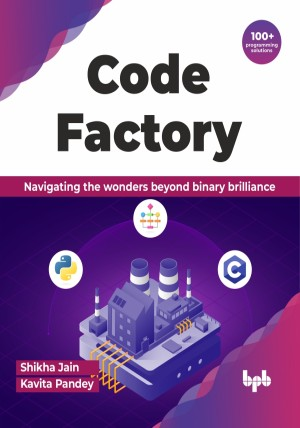

# Code Factory

Where algorithms dance and ideas ignite: Welcome to the rhythm of the code

This is the repository for [Code Factory
](https://bpbonline.com/products/code-factory?variant=43239937736904),published by BPB Publications.

## About the Book
Beginners in the programming world often wander to get some essential books to learn logic building with the help of algorithms, flowcharts, and minor C/Python language code. Addressing this demand, the book features over 100 solved programming questions thoughtfully arranged in incremental order of difficulty. The main objective of the book is to trigger and nurture logic-building skills among the students.  

The book is structured to introduce concepts gradually, ensuring a smooth learning curve. This guide gets you ready for any programming challenge, starting from simple input/output to tackling complex problem-solving. Learn decision-making with if-else, automate with loops, and understand logic using Python and C examples. Master algorithms, flowcharts, and creative thinking. Apply your skills to real-world problems and turn them into solutions.

This book will help the readers develop a well-rounded skill set covering flowcharts, algorithmic thinking, and practical implementation in both C and Python languages. It will provide a holistic foundation for anyone aspiring to become proficient in coding.

## What You Will Learn
• Learn programming comprehensively, from basics to advanced levels.

• Translate problem-solving methods into systematic flowcharts.

• Build a solid foundation in algorithmic design and problem-solving.

• Master intermediate and advanced programming techniques.

• Gain hands-on coding experience in C and Python languages.
